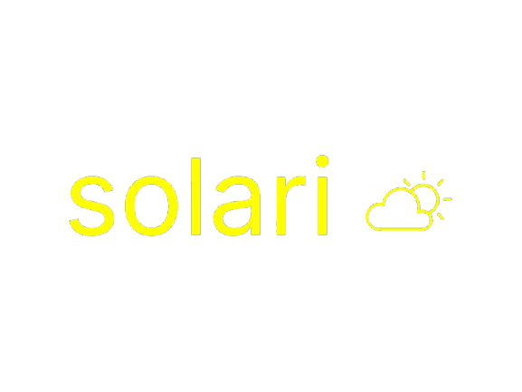
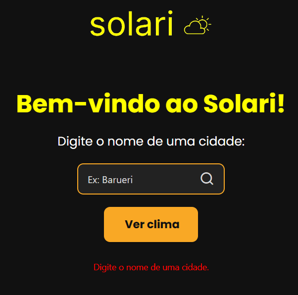
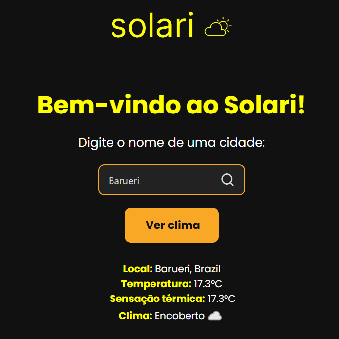

# Solari 🌤️
O Solari é um app desenvolvido em React Native que permite que **o usuário saiba o clima de qualquer cidade** digitando no campo de busca (ex: Barueri) 



# Telas 💻

## Tela principal (sem pesquisa)



## Tela principal (após pesquisa)



## Estrutura 🗂️

```bash
  solari-app/
├── App.js                     # Arquivo principal (e o único)
├── assets/
│   └── img/
│       ├── logo.png          # Logo do app
│       ├── solari.png        # Logo utilzada no app
│       ├── Tela1.png         # Imagem da tela inicial (para o README)
│       └── Tela2.png      # Imagem da tela inicial com os dados (para o README)
└── package.json              
```

## Passo a passo 📝

### 1. Clonar o repositório

```Git Bash
git clone https://github.com/dev1jsplima/solari.git #clona o repositório
cd solari-app #entra na pasta
```

### 2. Instale as dependências
- Saia do Git Bash e dentro da pasta, na barra de endereço, digite cmd

```cmd
npm install
REM Instala todas as dependências necessárias
```

### 3. Execute 
- Com o Expo instalado:

```cmd
npx expo-start
```

- Você pode escanear o QR Code caso queira testar o projeto no celular (precisa instalar o app Expo Go), mas se quiser também pode acessar o app pelo navegador (http://localhost:8081)

# Ferramentas utilizadas 🔧

- [React Native](https://reactnative.dev/) 
- [Expo](https://expo.dev/)
- [Weather API](https://www.weatherapi.com/)
  OBS: Infelizmente, a API usada só aceita nomes de cidade em inglês 😔
